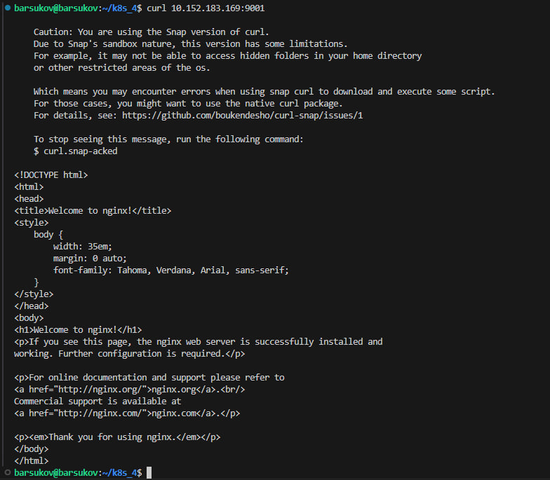
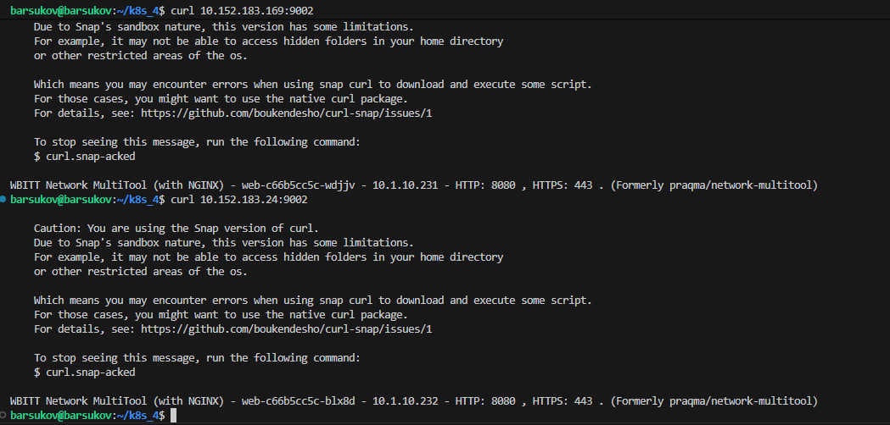

# Домашнее задание к занятию «Сетевое взаимодействие в Kubernetes» Барсуков Алексей

### Примерное время выполнения задания

120 минут

### Цель задания

Научиться настраивать доступ к приложениям в Kubernetes:
- Внутри кластера через **Service** (ClusterIP, NodePort).
- Снаружи кластера через **Ingress**.

Это задание поможет вам освоить базовые принципы сетевого взаимодействия в Kubernetes — ключевого навыка для работы с кластерами.
На практике Service и Ingress используются для доступа к приложениям, балансировки нагрузки и маршрутизации трафика. Понимание этих механизмов поможет вам упростить управление сервисами в рабочих окружениях и снизит риски ошибок при развёртывании.

------

## **Подготовка**
### **Чеклист готовности**
- Установлен Kubernetes (MicroK8S, Minikube или другой).
- Установлен `kubectl`.
- Редактор для YAML-файлов (VS Code, Vim и др.).

------

### Инструменты, которые пригодятся для выполнения задания

1. [Инструкция](https://microk8s.io/docs/getting-started) по установке MicroK8S.
2. [Инструкция](https://minikube.sigs.k8s.io/docs/start/?arch=%2Fwindows%2Fx86-64%2Fstable%2F.exe+download) по установке Minikube. 
3. [Инструкция](https://kubernetes.io/docs/tasks/tools/install-kubectl-windows/)по установке kubectl.
4. [Инструкция](https://marketplace.visualstudio.com/items?itemName=ms-kubernetes-tools.vscode-kubernetes-tools) по установке VS Code

### Дополнительные материалы, которые пригодятся для выполнения задания

1. [Описание](https://kubernetes.io/docs/concepts/workloads/controllers/deployment/) Deployment и примеры манифестов.
2. [Описание](https://kubernetes.io/docs/concepts/services-networking/service/) Описание Service.
3. [Описание](https://kubernetes.io/docs/concepts/services-networking/ingress/) Ingress.
4. [Описание](https://github.com/wbitt/Network-MultiTool) Multitool.

------

## **Задание 1: Настройка Service (ClusterIP и NodePort)**
### **Задача**
Развернуть приложение из двух контейнеров (`nginx` и `multitool`) и обеспечить доступ к ним:
- Внутри кластера через **ClusterIP**.
- Снаружи через **NodePort**.

### **Шаги выполнения**
1. **Создать Deployment** с двумя контейнерами:
   - `nginx` (порт `80`).
   - `multitool` (порт `8080`).
   - Количество реплик: `3`.
2. **Создать Service типа ClusterIP**, который:
   - Открывает `nginx` на порту `9001`.
   - Открывает `multitool` на порту `9002`.
3. **Проверить доступность** изнутри кластера:
```bash
 kubectl run test-pod --image=wbitt/network-multitool --rm -it -- sh
 curl <service-name>:9001 # Проверить nginx
 curl <service-name>:9002 # Проверить multitool
```
4. **Создать Service типа NodePort** для доступа к `nginx` снаружи.
5. **Проверить доступ** с локального компьютера:
```bash
 curl <node-ip>:<node-port>
   ```
 или через браузер.

### **Что сдать на проверку**
- Манифесты:
  - `deployment-multi-container.yaml`
  - `service-clusterip.yaml`
  - `service-nodeport.yaml`
- Скриншоты проверки доступа (`curl` или браузер).


#### ОТВЕТ

- Манифесты:
  - `deployment-multi-container.yaml`

```
apiVersion: apps/v1
kind: Deployment
metadata:
  name: web
  labels:
    app: web
spec:
  replicas: 3
  selector:
    matchLabels:
      app: web
  template:
    metadata:
      labels:
        app: web
    spec:
      containers:
      - name: nginx
        image: nginx:1.19.2
        ports:
        - containerPort: 80
      - name: multitool
        image: wbitt/network-multitool
        env:
          - name: HTTP_PORT
            value: "8080"
        ports:
        - containerPort: 8080
          name: http
```

  - `service-clusterip.yaml`

```
apiVersion: v1
kind: Service
metadata:
  name: multi-container-clusterip
spec:
  ports:
    - name: http-nginx
      port: 9001
      protocol: TCP
      targetPort: 80
    - name: http-multitool
      port: 9002
      protocol: TCP
      targetPort: 8080
  selector:
    app: web
```
  
  - `service-nodeport.yaml`

```
apiVersion: v1
kind: Service
metadata:
  name: multi-container-nodeport
spec:
  ports:
    - name: http-nginx
      port: 9001
      protocol: TCP
      targetPort: 80
    - name: http-multitool
      port: 9002
      protocol: TCP
      targetPort: 8080
  selector:
    app: web
```

запуск
```
barsukov@barsukov:~/k8s_4$ microk8s kubectl apply -f .
deployment.apps/web created
service/multi-container-clusterip created
service/multi-container-nodeport created
barsukov@barsukov:~/k8s_4$ microk8s kubectl get po
NAME                  READY   STATUS    RESTARTS   AGE
web-c66b5cc5c-blx8d   2/2     Running   0          116s
web-c66b5cc5c-s745x   2/2     Running   0          116s
web-c66b5cc5c-wdjjv   2/2     Running   0          116s
barsukov@barsukov:~/k8s_4$ kubectl get svc -o wide
NAME                        TYPE        CLUSTER-IP       EXTERNAL-IP   PORT(S)             AGE    SELECTOR
deployment-svc              ClusterIP   10.152.183.60    <none>        80/TCP,7080/TCP     74m    app=multitool
kubernetes                  ClusterIP   10.152.183.1     <none>        443/TCP             156m   <none>
multi-container-clusterip   ClusterIP   10.152.183.24    <none>        9001/TCP,9002/TCP   2m7s   app=web
multi-container-nodeport    ClusterIP   10.152.183.169   <none>        9001/TCP,9002/TCP   2m7s   app=web
nginx-svc                   ClusterIP   10.152.183.70    <none>        80/TCP              42m    app=nginx
barsukov@barsukov:~/k8s_4$  kubectl get pods -o wide
NAME                  READY   STATUS    RESTARTS   AGE     IP            NODE          NOMINATED NODE   READINESS GATES
web-c66b5cc5c-blx8d   2/2     Running   0          2m37s   10.1.10.232   barsukov.vm   <none>           <none>
web-c66b5cc5c-s745x   2/2     Running   0          2m37s   10.1.10.233   barsukov.vm   <none>           <none>
web-c66b5cc5c-wdjjv   2/2     Running   0          2m37s   10.1.10.231   barsukov.vm   <none>           <none>

```






---
## **Задание 2: Настройка Ingress**
### **Задача**
Развернуть два приложения (`frontend` и `backend`) и обеспечить доступ к ним через **Ingress** по разным путям.

### **Шаги выполнения**
1. **Развернуть два Deployment**:
   - `frontend` (образ `nginx`).
   - `backend` (образ `wbitt/network-multitool`).
2. **Создать Service** для каждого приложения.
3. **Включить Ingress-контроллер**:
```bash
 microk8s enable ingress
   ```
4. **Создать Ingress**, который:
   - Открывает `frontend` по пути `/`.
   - Открывает `backend` по пути `/api`.
5. **Проверить доступность**:
```bash
 curl <host>/
 curl <host>/api
   ```
 или через браузер.

### **Что сдать на проверку**
- Манифесты:
  - `deployment-frontend.yaml`
  - `deployment-backend.yaml`
  - `service-frontend.yaml`
  - `service-backend.yaml`
  - `ingress.yaml`
- Скриншоты проверки доступа (`curl` или браузер).

---
## Шаблоны манифестов с учебными комментариями
### **1. Deployment (nginx + multitool)**
```yaml
apiVersion: apps/v1
kind: Deployment
metadata:
  name: # ПРИМЕР: "multi-container-app"
spec:
  replicas: # ЗАДАНИЕ: Укажите количество реплик
  selector:
    matchLabels:
      app: # ДОПОЛНИТЕ: Метка для селектора
  template:
    metadata:
      labels:
        app: # ПОВТОРИТЕ метку из selector.matchLabels
    spec:
      containers:
 - name: # ЗАДАНИЕ: Название первого контейнера
        image: nginx
        ports:
 - containerPort: 80
 - name: multitool
        image: wbitt/network-multitool
        ports:
 - containerPort: 8080
        env:
 - name: HTTP_PORT
          value: "8080" # КЛЮЧЕВОЙ МОМЕНТ: Порт должен совпадать с containerPort
```
### **2. Ingress (для frontend и backend)**
```yaml
apiVersion: networking.k8s.io/v1
kind: Ingress
metadata:
  name: # ЗАДАНИЕ: Придумайте имя, допустим example-ingress
  annotations:  # ВАЖНО: Эта аннотация нужна для rewrite правил
    nginx.ingress.kubernetes.io/rewrite-target: /
spec:
  rules:
 - http:
      paths:
 - path: /
        pathType: Prefix
        backend:
          service:
            name: # УКАЖИТЕ: Имя frontend Service
            port:
              number: 80
 - path: /api # КЛЮЧЕВОЙ ПУТЬ: API endpoint
        pathType: Prefix
        backend:
          service:
            name: # УКАЖИТЕ: Имя backend Service
            port:
              number: 80
```
---

## **Правила приёма работы**
1. Домашняя работа оформляется в своём Git-репозитории в файле README.md. Выполненное домашнее задание пришлите ссылкой на .md-файл в вашем репозитории.
2. Файл README.md должен содержать скриншоты вывода необходимых команд `kubectl` и скриншоты результатов.
3. Репозиторий должен содержать тексты манифестов или ссылки на них в файле README.md.

## **Критерии оценивания задания**
1. Зачёт: Все задачи выполнены, манифесты корректны, есть доказательства работы (скриншоты).
2. Доработка (на доработку задание направляется 1 раз): основные задачи выполнены, при этом есть ошибки в манифестах или отсутствуют проверочные скриншоты.
3. Незачёт: работа выполнена не в полном объёме, есть ошибки в манифестах, отсутствуют проверочные скриншоты. Все попытки доработки израсходованы (на доработку работа направляется 1 раз). Этот вид оценки используется крайне редко.

## **Срок выполнения задания**  
1. 5 дней на выполнение задания.
2. 5 дней на доработку задания (в случае направления задания на доработку).
